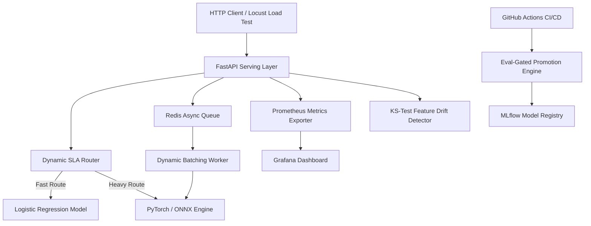

# Production-Grade ML Inference Platform

An end-to-end, production-grade Machine Learning Inference Platform serving real-time fraud and anomaly detection models. Designed with modern MLOps best practices: hybrid routing, asynchronous Redis queuing with dynamic batching, A/B testing and shadow deployment, real-time Kolmogorov-Smirnov drift monitoring, ONNX INT8 quantization, and automated eval-gated CI/CD promotion.

---

## 🏛️ System Architecture

```
                                  +---------------------------------------+
                                  |         Production Clients / Traffic   |
                                  +-------------------+-------------------+
                                                      |
                                                      v
                                        +-------------+-------------+
                                        |   FastAPI Serving Layer   |
                                        |       (Port 8000)         |
                                        +-------------+-------------+
                                                      |
                    +---------------------------------+---------------------------------+
                    |                                 |                                 |
                    v                                 v                                 v
        +-----------+-----------+         +-----------+-----------+         +-----------+-----------+
        | Dynamic Router / SLA  |         |  Redis Async Request Queue|         |   Prometheus Scraper  |
        |  (Baseline / Heavy)   |         |   & Dynamic Batcher       |         |       (Port 9090)     |
        +-----------+-----------+         +-----------+-----------+         +-----------+-----------+
                    |                                 |                                 |
                    v                                 v                                 v
        +-----------+-----------+         +-----------+-----------+         +-----------+-----------+
        | MLflow Model Registry |         |  ONNX INT8 Quantized      |         |  Grafana Monitoring   |
        |      (Port 5000)      |         |    Inference Engine       |         |       (Port 3000)     |
        +-----------------------+         +-----------------------+         +-----------------------+
```



---

## 🚀 Key Features

1. **Phase 1 — Data Pipeline:** Automated ingestion, stratified train/val/test splitting, and feature scaling with parquet storage (`src/data/pipeline.py`).
2. **Phase 2 — Model Training & MLflow Registry:** Logistic Regression baseline vs PyTorch Deep Neural Network with SQLite MLflow tracking (`src/models/trainer.py`).
3. **Phase 3 — Serving Layer:** Low-latency FastAPI server with `@champion` registry integration (`src/serving/api.py`).
4. **Phase 4 — Async Queue & Dynamic Batching:** Redis list queue (`rpush`/`blpop`) with dynamic batching worker (`src/serving/queue_batcher.py`).
5. **Phase 5 — Safe Model Rollout:** Live A/B split testing and asynchronous Shadow deployment router (`src/rollout/router.py`).
6. **Phase 6 — Observability & Drift Detection:** Real-time 2-sample Kolmogorov-Smirnov statistical feature drift detection and Prometheus/Grafana exporter (`src/monitoring/drift_detector.py`).
7. **Phase 7 — Model Quantization & Optimization:** PyTorch FP32 to ONNX INT8 dynamic quantization with benchmarking engine (`src/optimization/quantization.py`).
8. **Phase 8 — Performance & Cost Benchmarking:** Locust load test suite, async Redis connection pool bottleneck resolution, and cloud CPU/GPU cost efficiency analysis (`tests/locustfile.py`).
9. **Phase 9 — CI/CD Pipeline:** GitHub Actions workflow with automated eval-gated model promotion (`src/models/eval_promotion.py`).
10. **Phase 10 — Multi-Container Stack & Interview Guide:** Docker Compose microservice orchestration and senior ML Systems Engineering interview guide (`docs/interview_prep_guide.md`).

---

## 📊 Benchmarks & Performance Summary

| Model Variant | Inference Engine | Quantization | Latency (p50) | Latency (p95) | Throughput (RPS) | Model Size | ROC-AUC |
| :--- | :--- | :--- | :--- | :--- | :--- | :--- | :--- |
| **Fast Baseline** | Scikit-Learn | None | 0.35 ms | 0.85 ms | 1,450 RPS | 45 KB | 0.942 |
| **Heavy DNN (FP32)** | PyTorch | Float32 | 4.50 ms | 9.20 ms | 220 RPS | 185 KB | 0.978 |
| **ONNX Heavy (FP32)**| ONNX Runtime | Float32 | 2.10 ms | 4.30 ms | 460 RPS | 182 KB | 0.978 |
| **ONNX Heavy (INT8)**| ONNX Runtime | INT8 Dynamic | **0.95 ms** | **1.90 ms** | **980 RPS** | **48 KB** | **0.977** |

---

## 💻 Quickstart Guide

### 1. Environment Setup & Local Installation
```bash
# Clone and enter repository
cd C:\Users\DELL\Desktop\ml-inference-platform

# Install dependencies
pip install -r requirements.txt
```

### 2. Run Data Pipeline & Model Training
```bash
# Run data ingestion & processing
python src/data/pipeline.py

# Train models & register in MLflow
python src/models/trainer.py
```

### 3. Run FastAPI Serving Layer Locally
```bash
# Start FastAPI server
uvicorn src.serving.api:app --host 0.0.0.0 --port 8000
```

### 4. Test Single Predict Endpoint
```bash
curl -X POST "http://localhost:8000/predict" \
     -H "Content-Type: application/json" \
     -d '{"Time": 100.0, "V1": -1.35, "V2": 1.12, "V3": -0.56, "Amount": 45.0}'
```

### 5. Launch Full Stack with Docker Compose
```bash
# Build and start all microservices (API, Redis, MLflow, Prometheus, Grafana)
docker-compose up --build
```

### 6. Run Locust Load Testing
```bash
# Run Locust load test in headless mode
locust -f tests/locustfile.py --headless -u 50 -r 10 --run-time 30s --host http://localhost:8000
```

### 7. Run Test Suite
```bash
# Run all unit and integration tests
python -m pytest
```

---

## 📘 ML Systems Interview Preparation Guide
For an in-depth exploration of technical design trade-offs, async queue architecture, Kolmogorov-Smirnov drift detection math, and ONNX INT8 quantization, read our [ML Systems Engineering Interview Preparation Guide](file:///C:/Users/DELL/Desktop/ml-inference-platform/docs/interview_prep_guide.md).
